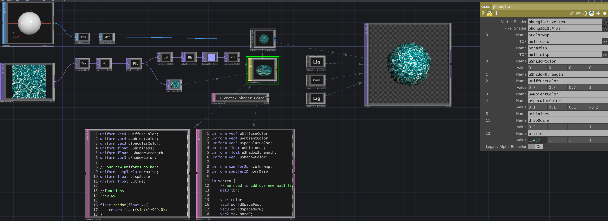

# GLSL Vertex Displacement

A TouchDesigner project demonstrating a GLSL technique for displacing 3D geometry in real-time using a 2D texture. This example showcases an efficient shader that uses a single texture for both vertex displacement (via the alpha channel) and normal mapping (via the RGB channels).



## How It Works

This project uses a single GLSL Material (MAT) to control both the shape and the surface lighting of a sphere.

1.  **Vertex Shader (Shape):** The vertex shader reads the **alpha channel** of an input texture. It uses this value to push each vertex of the sphere outwards along its normal, "sculpting" the geometry in real-time.
2.  **Fragment Shader (Surface Detail):** The fragment shader reads the **RGB channels** of the same input texture and interprets them as a normal map. This allows the lighting to interact with the deformed surface as if it had complex, fine-grained detail.

## Usage

Open the `.toe` file in TouchDesigner. You can swap out the input texture connected to the `GLSL MAT` with any image to see how it affects the final shape and lighting.

---

## GLSL Notes & Learnings

A collection of notes from my research into GLSL for this project.

### Common Use Cases for GLSL in TouchDesigner

*   Creating complex 2D/3D generative visuals.
*   Manipulating 3D geometry directly on the GPU.
*   Building highly performant compositing and effects workflows.
*   Generating dynamic textures for interactive installations.

### The Basic Graphics Pipeline

The two primary programmable stages of the graphics pipeline are the Vertex Shader and the Fragment Shader.

| Shader Type     | File Extension | Purpose                                             |
| --------------- | -------------- | --------------------------------------------------- |
| **Vertex Shader**   | `.vert`        | Processes each individual vertex (position, etc.).    |
| **Fragment Shader** | `.frag`        | Processes each individual pixel/fragment (color, etc.). |

> In TouchDesigner, the **GLSL TOP** uses only a Fragment Shader. The **GLSL MAT**, used in this project, uses both a Vertex and a Fragment Shader.

### Vertex Shader: Attributes & Coordinates

The Vertex Shader is responsible for the position of each point in 3D space. It receives several built-in attributes from TouchDesigner geometry.

| Name | Type   | Size | Description                               |
| ---- | ------ | ---- | ----------------------------------------- |
| `P`  | `vec3` | 3    | The incoming vertex position.             |
| `N`  | `vec3` | 3    | The surface normal vector for the vertex. |
| `uv` | `vec3` | 3    | The texture coordinates (UVs).            |
| `Cd` | `vec4` | 4    | The vertex color (RGBA).                  |

Vertex Shaders operate in **Normalized Device Coordinates (NDC)**, where the visible space ranges from **-1.0 to 1.0** on each axis, with (0,0) at the center.

```
Vertex Shader Coordinates	

(-1.0,1.0)  ┏╍╍╍╍╍╍╍┳╍╍╍╍╍╍╍┓ (1.0,1.0)
		    ╏                 
		    ╏               
		    ╏	  	    
x		    ┣ x,y(0.0,0.0)   
		    ╏               
		    ╏                
		    ╏               
(-1.0,-1.0) ┗╍╍╍╍╍╍╍┻╍╍╍╍╍╍╍┛ (1.0,-1.0)	
 		    y
```

### Fragment Shader: Coordinates

The Fragment (or Pixel) Shader is responsible for the color of each pixel on the screen. It primarily works with **UV Coordinates**, which are normalized and range from **0.0 to 1.0**, with (0,0) at the bottom-left corner. This makes it easy to map textures to surfaces.

```
Fragment (Pixel) Shader	Coordinates	

(0.0,0.1) ┏╍╍╍╍╍╍╍┳╍╍╍╍╍╍╍┓ (1.0,1.0)
		  ╏                 
		  ╏               
		  ╏		 	  
x 		  ┣ x,y(0.5,0.5)   
		  ╏               
		  ╏               
		  ╏               
(0.0,0.0) ┗╍╍╍╍╍╍╍┻╍╍╍╍╍╍╍┛ (1.0,0.0)	
		  y
```           			

### Project Links & Demos

*   **Project Write-up:** [https://stevenmbenton.com/glsl-vertex-displacement/](https://https://stevenmbenton.com/glsl-vertex-displacement//)
